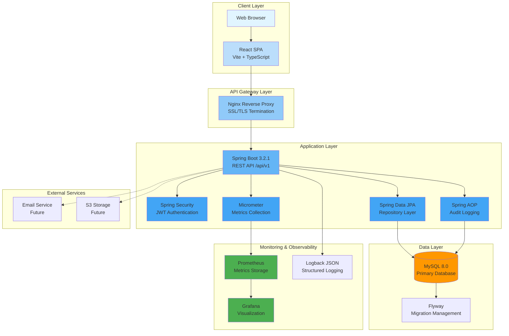
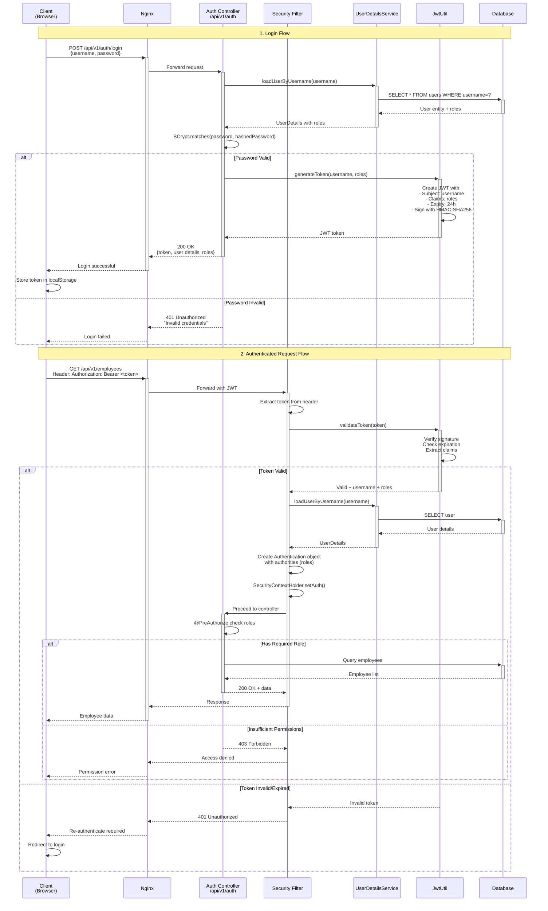
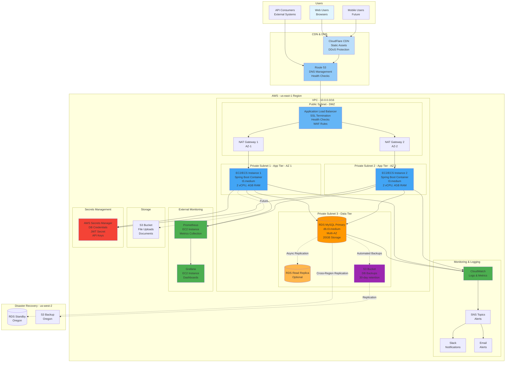

# Ecovale HR Management System - Architecture Documentation

## 📐 Overview

This document provides comprehensive architectural diagrams and documentation for the Ecovale HR Management System, including system architecture, authentication flows, CI/CD pipelines, and deployment architecture.

**Last Updated**: January 26, 2026  
**Version**: 1.0.0

---

## 🏗️ System Architecture Diagram

### High-Level Architecture



### Component Details

#### Frontend Layer
- **Technology**: React 18 + TypeScript + Vite
- **State Management**: Context API
- **Routing**: Custom page switching via AppContext
- **Styling**: Tailwind-like utility classes
- **Build Tool**: Vite (fast HMR)

#### Backend Layer
- **Framework**: Spring Boot 3.2.1
- **Language**: Java 17
- **API Version**: v1 (/api/v1/*)
- **Documentation**: OpenAPI 3.0 + Swagger UI
- **Security**: Spring Security + JWT (HMAC SHA-256)
- **Database Access**: Spring Data JPA + Hibernate
- **Migration**: Flyway (V1-V8 migrations)

#### Data Layer
- **Database**: MySQL 8.0
- **Connection Pool**: HikariCP
- **Backup**: Automated daily backups with 30-day retention
- **Charset**: UTF-8MB4 (full Unicode support)

#### Monitoring Stack
- **Metrics**: Micrometer + Prometheus
- **Visualization**: Grafana dashboards
- **Logging**: Logback with JSON formatting
- **Health Checks**: Spring Actuator

---

## 🔐 JWT Authentication Flow



### Token Structure

```
Header:
{
  "alg": "HS256",
  "typ": "JWT"
}

Payload:
{
  "sub": "admin",
  "roles": ["ROLE_ADMIN", "ROLE_HR"],
  "iat": 1706265600,
  "exp": 1706352000
}

Signature:
HMACSHA256(
  base64UrlEncode(header) + "." + base64UrlEncode(payload),
  secret-key
)
```

### Security Features

- **Token Expiry**: 24 hours (configurable)
- **Algorithm**: HMAC SHA-256
- **Storage**: localStorage (client-side)
- **Transport**: Authorization header (Bearer scheme)
- **Password Hashing**: BCrypt (strength 12)
- **Rate Limiting**: 100 requests/minute per IP
- **CSRF Protection**: Enabled for state-changing operations

---

## 🔄 CI/CD Workflow Diagram

```mermaid
graph LR
    subgraph "Source Control"
        A[GitHub Repository<br/>main/develop branches]
    end
    
    subgraph "CI Pipeline - GitHub Actions"
        A -->|Push/PR| B[1. Build & Test<br/>Maven compile<br/>Run unit tests<br/>Run integration tests]
        B -->|Success| C[2. Code Quality<br/>SonarQube scan<br/>Code coverage check<br/>Security analysis]
        C -->|Success| D[3. Security Scan<br/>OWASP Dependency Check<br/>Snyk vulnerability scan<br/>Trivy container scan]
        D -->|Success| E[4. Build Docker Image<br/>Multi-stage Dockerfile<br/>Tag with commit SHA<br/>Push to registry]
    end
    
    subgraph "Artifact Storage"
        E --> F[Docker Hub<br/>or<br/>AWS ECR<br/>Container Registry]
    end
    
    subgraph "CD Pipeline"
        F -->|Deploy Trigger| G{Environment?}
        G -->|Dev Branch| H[Development<br/>Auto-deploy<br/>api-dev.ecovale.com]
        G -->|Staging Branch| I[Staging<br/>Manual approval<br/>api-staging.ecovale.com]
        G -->|Main Branch| J[Production<br/>Manual approval<br/>api.ecovale.com]
    end
    
    subgraph "Deployment"
        H --> K[AWS EC2/ECS<br/>Deploy container<br/>Run DB migrations<br/>Health check]
        I --> K
        J --> K
    end
    
    subgraph "Post-Deployment"
        K --> L[Health Checks<br/>Smoke Tests<br/>Integration Tests]
        L -->|Success| M[Slack/Email<br/>Notification]
        L -->|Failure| N[Rollback<br/>Previous version]
        N --> M
    end
    
    style A fill:#e1f5ff
    style B fill:#bbdefb
    style C fill:#90caf9
    style D fill:#64b5f6
    style E fill:#42a5f5
    style F fill:#ff9800
    style H fill:#4caf50
    style I fill:#ffeb3b
    style J fill:#f44336
    style K fill:#9c27b0
    style L fill:#795548
```



### Pipeline Stages Breakdown

#### Stage 1: Build & Test (5-7 minutes)
```yaml
- Checkout code
- Setup Java 17
- Cache Maven dependencies
- mvn clean compile
- mvn test (unit tests)
- mvn verify (integration tests)
- Upload test reports
```

#### Stage 2: Code Quality (3-5 minutes)
```yaml
- SonarQube analysis
  - Code coverage > 80%
  - No critical bugs
  - Technical debt < 5%
- Generate coverage report
- Upload to SonarCloud
```

#### Stage 3: Security Scan (5-10 minutes)
```yaml
- OWASP Dependency Check
  - Scan dependencies for CVEs
  - Fail on HIGH/CRITICAL vulnerabilities
- Snyk security scan
  - Check for known vulnerabilities
- Trivy container scan
  - Scan Docker image for OS vulnerabilities
```

#### Stage 4: Build Docker Image (3-5 minutes)
```yaml
- Build multi-stage Docker image
- Tag: ecovale-hr:${COMMIT_SHA}
- Tag: ecovale-hr:latest (if main branch)
- Push to container registry
- Sign image with Cosign (future)
```

#### Stage 5: Deploy (Environment-specific)
```yaml
# Development (Auto)
- Deploy to dev EC2/ECS
- Run Flyway migrations
- Health check: /actuator/health
- Smoke tests

# Staging (Manual approval)
- Require approval from team lead
- Deploy to staging
- Run full test suite
- Performance tests

# Production (Manual approval)
- Require approval from 2 reviewers
- Blue-green deployment
- Database backup before migration
- Canary release (10% traffic)
- Monitor for 15 minutes
- Full rollout or rollback
```

### CI/CD Environment Variables

```bash
# Build
JAVA_VERSION=17
MAVEN_OPTS=-Xmx2g

# Database (Migrations)
DB_HOST=<rds-endpoint>
DB_NAME=ecovale_hr
DB_USERNAME=<encrypted>
DB_PASSWORD=<encrypted>

# Security
JWT_SECRET=<encrypted-secret>
SONAR_TOKEN=<encrypted-token>

# Docker
DOCKER_USERNAME=<encrypted>
DOCKER_PASSWORD=<encrypted>

# AWS
AWS_REGION=us-east-1
AWS_ACCESS_KEY_ID=<encrypted>
AWS_SECRET_ACCESS_KEY=<encrypted>

# Notifications
SLACK_WEBHOOK_URL=<encrypted>
```

---

## 🚀 Production Deployment Architecture



### Infrastructure Specifications

#### Load Balancer (ALB)
```
Type: Application Load Balancer
Scheme: Internet-facing
Availability Zones: 2 (us-east-1a, us-east-1b)
Listeners:
  - HTTPS:443 (SSL Certificate from ACM)
  - HTTP:80 (Redirect to HTTPS)
Target Groups:
  - Backend: 2 EC2/ECS instances
  - Health Check: GET /actuator/health
  - Healthy Threshold: 2
  - Unhealthy Threshold: 3
  - Interval: 30s
  - Timeout: 5s
Security:
  - AWS WAF rules (Rate limiting, SQL injection, XSS)
  - Security groups restrict to 80/443
```

#### Application Tier (EC2/ECS)
```
Instance Type: t3.medium
vCPU: 2
Memory: 4 GB
OS: Amazon Linux 2023
Container: Docker (Spring Boot)
Auto Scaling:
  - Min: 2 instances
  - Max: 10 instances
  - Target CPU: 70%
  - Scale up: +2 instances if CPU > 70% for 5 min
  - Scale down: -1 instance if CPU < 30% for 10 min
Security:
  - Security group: Only ALB can access 8080
  - No public IP
  - Access via Systems Manager
  - IAM role for AWS service access
```

#### Database Tier (RDS MySQL)
```
Engine: MySQL 8.0
Instance: db.t3.medium
vCPU: 2
Memory: 4 GB
Storage: 20 GB (gp3)
Multi-AZ: Yes (Automatic failover)
Backup:
  - Automated daily backups
  - Retention: 30 days
  - Point-in-time recovery
  - Cross-region backup to us-west-2
Read Replicas: 1 (optional for read-heavy loads)
Encryption: At rest (KMS) and in transit (SSL)
Security:
  - Security group: Only app tier can access 3306
  - No public access
  - Master credentials in Secrets Manager
```

#### Monitoring & Alerting
```
CloudWatch:
  - Application logs (JSON format)
  - System metrics (CPU, Memory, Disk)
  - Custom metrics (API latency, error rates)
  
Prometheus:
  - Scrapes /actuator/prometheus every 15s
  - Stores metrics for 15 days
  - Retention: 15 days local, 1 year S3

Grafana:
  - Pre-built dashboards
  - JVM metrics
  - API performance
  - Database connections
  - Business metrics (leaves, employees)

Alerts:
  - CPU > 80% for 10 minutes
  - Memory > 90% for 5 minutes
  - Error rate > 5% for 3 minutes
  - Response time P95 > 1s
  - Database connections > 80% pool
  - Failed health checks
  - Failed deployments
```

### Network Security

#### VPC Configuration
```
VPC CIDR: 10.0.0.0/16

Public Subnets (DMZ):
  - 10.0.1.0/24 (us-east-1a) - ALB, NAT Gateway
  - 10.0.2.0/24 (us-east-1b) - ALB, NAT Gateway

Private Subnets (App Tier):
  - 10.0.10.0/24 (us-east-1a) - EC2/ECS
  - 10.0.11.0/24 (us-east-1b) - EC2/ECS

Private Subnets (Data Tier):
  - 10.0.20.0/24 (us-east-1a) - RDS Primary
  - 10.0.21.0/24 (us-east-1b) - RDS Standby

Internet Gateway: Attached to public subnets
NAT Gateway: 2 (one per AZ for HA)
Route Tables: Separate for public/private tiers
```

#### Security Groups
```
ALB Security Group:
  Inbound:
    - 443 from 0.0.0.0/0 (HTTPS)
    - 80 from 0.0.0.0/0 (HTTP - redirect)
  Outbound:
    - 8080 to App Tier SG

App Tier Security Group:
  Inbound:
    - 8080 from ALB SG
    - 22 from Systems Manager (no public SSH)
  Outbound:
    - 3306 to RDS SG
    - 443 to Internet (for APIs, updates)

RDS Security Group:
  Inbound:
    - 3306 from App Tier SG only
  Outbound:
    - None
```

### Disaster Recovery Strategy

#### RTO & RPO Targets
```
Recovery Time Objective (RTO): 4 hours
Recovery Point Objective (RPO): 1 hour

Backup Strategy:
  - Automated daily snapshots (RDS)
  - Transaction logs backed up every 5 minutes
  - Cross-region replication to us-west-2
  - S3 backup retention: 30 days

Failover Procedure:
  1. Promote read replica to master (5 minutes)
  2. Update DNS to point to new region (5 minutes)
  3. Deploy application to DR region (30 minutes)
  4. Validate and smoke test (30 minutes)
  5. Monitor and adjust (ongoing)
```

---

## 📊 Data Flow Diagrams

### Employee Creation Flow

```
┌─────────────┐      ┌──────────────┐      ┌─────────────┐      ┌──────────┐
│   Browser   │─────▶│    Nginx     │─────▶│   Spring    │─────▶│  MySQL   │
│  (React)    │      │  Reverse     │      │    Boot     │      │          │
└─────────────┘      │   Proxy      │      │             │      └──────────┘
      │              └──────────────┘      │  Controller │           │
      │                                    │     ↓       │           │
      │                                    │  Service    │           │
      │                                    │     ↓       │           │
      │                                    │ Repository  │           │
      │                                    │     ↓       │           │
      │                                    │   Audit     │           │
      │                                    │   Logger    │───────────┘
      │                                    └─────────────┘
      │
      └──────────────────────────────────────────────────────────────────┐
                                                                          │
    ┌───────────────────────────────────────────────────────────────┐   │
    │ 1. POST /api/v1/employees + JWT token                         │◀──┘
    │ 2. Nginx forwards to Spring Boot                              │
    │ 3. JWT filter validates token                                 │
    │ 4. @PreAuthorize checks ADMIN role                            │
    │ 5. Controller validates @Valid EmployeeRequestDTO             │
    │ 6. Service checks for duplicate employee ID                   │
    │ 7. Repository saves to employees table                        │
    │ 8. AOP intercepts and logs CREATE action to audit_logs table  │
    │ 9. Response sent back: 201 Created + EmployeeResponseDTO      │
    └───────────────────────────────────────────────────────────────┘
```

### Leave Approval Workflow

```
┌──────────┐     ┌──────────┐     ┌──────────┐
│ Employee │────▶│ Manager  │────▶│  Admin   │
│ Creates  │     │ Approves │     │ Approves │
│  Leave   │     │  (Level  │     │ (Final)  │
│          │     │    1)    │     │          │
└──────────┘     └──────────┘     └──────────┘
     │                │                 │
     │                │                 │
     ▼                ▼                 ▼
┌─────────────────────────────────────────────┐
│          Leave Status Transitions           │
├─────────────────────────────────────────────┤
│ PENDING ──────▶ MANAGER_APPROVED ──────▶   │
│    │              │           ADMIN_APPROVED │
│    │              │                          │
│    ▼              ▼                          │
│ REJECTED     REJECTED                        │
│    │              │                          │
│    └──────────────┴─────────────▶           │
│                            CANCELLED         │
└─────────────────────────────────────────────┘

Audit Trail:
- CREATE: Employee submits leave request
- UPDATE: Manager approves (status → MANAGER_APPROVED)
- UPDATE: Admin approves (status → ADMIN_APPROVED)
- Each change logged with username, timestamp, comments
```

---

## 🔍 Technology Stack Summary

### Backend Stack
| Component | Technology | Version | Purpose |
|-----------|-----------|---------|---------|
| Framework | Spring Boot | 3.2.1 | Application framework |
| Language | Java | 17 | Programming language |
| Build Tool | Maven | 3.9+ | Dependency management |
| Security | Spring Security | 6.2 | Authentication/Authorization |
| JWT | JJWT | 0.12.3 | Token generation/validation |
| Database | MySQL | 8.0 | Data persistence |
| ORM | Hibernate | 6.4 | Object-relational mapping |
| Migration | Flyway | 9.22 | Database versioning |
| API Docs | SpringDoc OpenAPI | 2.3.0 | OpenAPI/Swagger |
| Logging | Logback | 1.4 | Structured logging |
| Metrics | Micrometer | 1.12 | Application metrics |
| Rate Limit | Bucket4j | 8.7.0 | Rate limiting |
| Testing | JUnit 5 | 5.10 | Unit testing |

### Frontend Stack
| Component | Technology | Version | Purpose |
|-----------|-----------|---------|---------|
| Framework | React | 18 | UI framework |
| Language | TypeScript | 5.2 | Type-safe JavaScript |
| Build Tool | Vite | 5.0 | Fast build tool |
| State | Context API | Built-in | State management |
| HTTP Client | Fetch API | Built-in | API communication |
| Styling | CSS | Custom | Component styling |

### Infrastructure Stack
| Component | Technology | Purpose |
|-----------|-----------|---------|
| Cloud | AWS | Infrastructure hosting |
| Load Balancer | ALB | Traffic distribution |
| Compute | EC2/ECS | Application hosting |
| Database | RDS MySQL | Managed database |
| Storage | S3 | Backups & file storage |
| CDN | CloudFlare | Content delivery |
| DNS | Route 53 | Domain management |
| Secrets | Secrets Manager | Credential management |
| Monitoring | CloudWatch | AWS metrics & logs |
| Metrics | Prometheus | Metrics collection |
| Visualization | Grafana | Dashboards |
| Container | Docker | Application packaging |
| Orchestration | ECS | Container management |
| CI/CD | GitHub Actions | Automated deployment |

---

## 🔗 Related Documentation

- [API Documentation](backend/API-DOCUMENTATION.md) - REST API reference
- [API Quick Reference](backend/API-QUICK-REFERENCE.md) - Quick start guide
- [Leave Management Guide](backend/LEAVE-MANAGEMENT-GUIDE.md) - Leave module details
- [Frontend Migration Checklist](FRONTEND-MIGRATION-CHECKLIST.md) - Frontend updates
- [README.md](README.md) - Project overview

---

## 📞 Support

For architecture questions or infrastructure support:
- **Email**: devops@ecovale.com
- **Slack**: #architecture
- **Wiki**: https://wiki.ecovale.com/hr-system

---

**Document Version**: 1.0.0  
**Last Updated**: January 26, 2026  
**Maintained By**: Ecovale DevOps & Architecture Team
